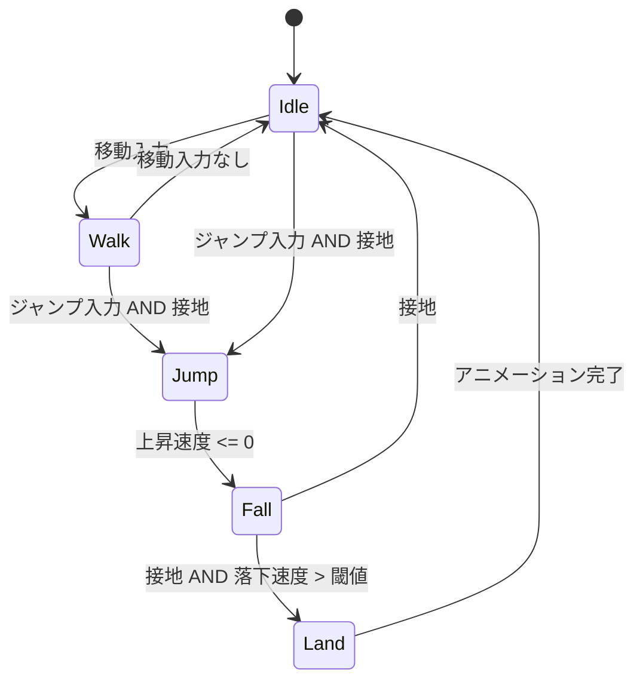

# Design Patterns for Games

ゲーム開発でよく使用する設計パターンのガイド。

## 参照元ガイドライン

- 🧩 module-design-agent.md - モジュール設計時（パターン選択）
- 🏗️ design-agent.md - 詳細設計時（構造定義）
- ⚙️ behavior-agent.md - 振る舞い定義時（状態遷移、ロジック）

---

## パターン早見表

| パターン | 用途 | インゲーム | アウトゲーム |
|---------|------|-----------|-------------|
| Factory | エンティティ生成 | ◎ | ○ |
| Strategy | AI、攻撃パターン | ◎ | △ |
| Observer | イベント通知 | ◎ | ◎ |
| State | 状態遷移 | ○ | ◎ |
| Command | 入力処理、Undo | ○ | ◎ |
| Component | 機能の組み合わせ | ◎ | △ |
| Object Pool | パフォーマンス | ◎ | × |

◎: 頻出 ○: 使用する △: 場合による ×: 稀

---

## Factory Pattern

### 目的
オブジェクトの生成ロジックを一箇所に集約し、データ駆動での生成を可能にする。

### ゲームでの使用例
- 敵エンティティの生成
- 弾丸/エフェクトの生成
- アイテムの生成
- ステージギミックの生成

### 構造
```
[Client] --> [Factory] --> [Product]
                 |
                 v
            [DataLoader]
                 |
                 v
            [8_data/*.md]
```

### 拡張性
- 新しい種類の追加: データファイル追加のみ
- Factory 本体の変更: 不要
- 既存コードへの影響: なし

### いつ使うか
- エンティティの種類が将来増える（EXT で明記されている）
- データファイルから動的に生成したい
- 生成ロジックを一箇所に集約したい
- 同じ種類のオブジェクトを複数生成する

### design.md への記述例
```markdown
#### EnemyFactory
| Field | Type | Description |
|-------|------|-------------|
| dataPath | string | データファイルのパス |
| prefabRegistry | Dictionary<string, Prefab> | 生成用プレハブ |

#### EnemyData（8_data/ から読み込む構造）
| Field | Type | Description |
|-------|------|-------------|
| id | string | 敵ID |
| hp | int | 初期HP |
| speed | float | 移動速度 |
| aiType | string | AIStrategy の種別 |
```

### behavior.md への記述例
```markdown
### EnemyFactorySystem

**責務**: データファイルから敵エンティティを生成

**フィルタ条件**: SpawnRequest Component を持つ Entity

**入力**: SpawnRequest（生成要求）
**出力**: Enemy Entity（生成された敵）

**ロジック**:
1. SpawnRequest から敵IDを取得
2. DataLoader で 8_data/enemies/ から該当データを読み込み
3. データに基づいて Enemy Entity を生成
4. aiType に応じた AIStrategy を設定
5. SpawnRequest を削除
```

---

## Strategy Pattern

### 目的
アルゴリズムをカプセル化し、実行時に差し替え可能にする。

### ゲームでの使用例
- 敵AI（徘徊、追跡、逃走、待機）
- 攻撃パターン（近接、遠距離、範囲、貫通）
- 移動方式（歩行、飛行、テレポート、ジャンプ）
- ダメージ計算（物理、魔法、属性）

### 構造
```
[Context] --> [IStrategy]
                   ^
                   |
     +-------------+-------------+
     |             |             |
[StrategyA]  [StrategyB]  [StrategyC]
```

### 拡張性
- 新しい戦略の追加: 新クラス追加のみ
- 既存コードの変更: 不要
- データファイルで戦略を指定可能

### いつ使うか
- 振る舞いのバリエーションが増える（EXT で明記されている）
- 実行時に振る舞いを切り替えたい
- テスト時にモック差し替えしたい
- 同じインターフェースで異なる実装が必要

### design.md への記述例
```markdown
#### IAIStrategy（インターフェース）
```csharp
public interface IAIStrategy
{
    void Execute(AIContext context);
    bool CanExecute(AIContext context);
}
```

#### AIContext
| Field | Type | Description |
|-------|------|-------------|
| self | Entity | 自身のEntity |
| target | Entity | ターゲット（nullable） |
| deltaTime | float | 経過時間 |
```

### behavior.md への記述例
```markdown
### PatrolAI（IAIStrategy実装）

**責務**: 指定範囲を巡回する

**ロジック**:
1. 次のウェイポイントに向かって移動
2. ウェイポイント到達で次へ
3. 最後のウェイポイントで最初に戻る

**遷移条件**:
- プレイヤーを視認 → ChaseAI に切り替え
```

---

## Observer Pattern (EventSystem)

### 目的
オブジェクト間の疎結合な通信を実現する。

### ゲームでの使用例
- ダメージ発生 → UI更新、エフェクト再生、サウンド再生
- 敵撃破 → スコア加算、アイテムドロップ、実績チェック
- ゲーム状態変更 → 各システムへの通知
- プレイヤー死亡 → ゲームオーバー処理

### 構造
```
[Publisher] ---(Event)---> [EventSystem] ---> [Subscriber A]
                                         ---> [Subscriber B]
                                         ---> [Subscriber C]
```

### 拡張性
- 新しい購読者の追加: 既存コード変更不要
- イベントの追加: EventType の追加のみ
- 発行者と購読者は互いを知らない

### いつ使うか
- モジュール間の直接参照を避けたい
- 1対多の通知が必要
- 発火タイミングと処理を分離したい
- Entity間の相互作用（Player ↔ Enemy は直接参照禁止）

### 禁止パターン
- Entity間の直接参照（Player → Enemy）
- 循環依存（A → B → A）
- イベントの連鎖が深すぎる（デバッグ困難）

### design.md への記述例
```markdown
#### DamageEvent
| Field | Type | Description |
|-------|------|-------------|
| source | EntityId | ダメージ発生源 |
| target | EntityId | ダメージ対象 |
| amount | int | ダメージ量 |
| damageType | DamageType | ダメージ種別 |

#### DamageType（Enum）
| Value | Description |
|-------|-------------|
| Physical | 物理ダメージ |
| Magic | 魔法ダメージ |
| True | 防御無視ダメージ |
```

### behavior.md への記述例
```markdown
### DamageEventPublisher

**責務**: 衝突判定からダメージイベントを発行

**ロジック**:
1. 攻撃判定と被弾判定の衝突を検出
2. DamageEvent を生成
3. EventSystem に Publish

### DamageEventSubscriber（UI）

**責務**: ダメージ表示

**購読**: DamageEvent

**ロジック**:
1. ダメージ量を受け取り
2. ダメージ数字UIを生成
3. ターゲット位置に表示
```

---

## State Pattern

### 目的
状態に応じた振る舞いの変更を明確にする。

### ゲームでの使用例
- ゲームフロー（タイトル → プレイ → ポーズ → リザルト）
- キャラクター状態（Idle → Walk → Jump → Fall → Land）
- UI画面状態（メニュー → オプション → 確認ダイアログ）
- ボス戦フェーズ（Phase1 → Phase2 → Enrage）

### 構造
```
[Context] --> [IState]
                  ^
                  |
    +-------------+-------------+
    |             |             |
 [StateA]     [StateB]     [StateC]
```

### 拡張性
- 新しい状態の追加: 新クラス追加と遷移定義
- 状態ごとのロジックが分離される
- 遷移条件が明確になる

### いつ使うか
- 状態によって振る舞いが大きく変わる
- 状態遷移が複雑
- 状態ごとに許可/禁止アクションが異なる
- アウトゲームの画面遷移管理

### behavior.md への記述例
```markdown
## State Transition



### 各状態での許可アクション
| 状態 | 移動 | ジャンプ | 攻撃 |
|------|------|---------|------|
| Idle | ○ | ○ | ○ |
| Walk | ○ | ○ | ○ |
| Jump | ○ | × | ○ |
| Fall | ○ | × | ○ |
| Land | × | × | × |
```

---

## Command Pattern

### 目的
操作をオブジェクトとしてカプセル化し、実行/取り消しを可能にする。

### ゲームでの使用例
- 入力バッファリング（格闘ゲームのコマンド入力）
- Undo/Redo（エディタ、パズルゲーム）
- リプレイ機能
- AI行動のキュー管理

### 構造
```
[Invoker] --> [ICommand] --> [Receiver]
                  ^
                  |
    +-------------+-------------+
    |             |             |
[CommandA]   [CommandB]   [CommandC]
```

### 拡張性
- 新しいコマンドの追加: 新クラス追加のみ
- 実行履歴の管理が容易
- コマンドの組み合わせ（マクロ）が可能

### いつ使うか
- 操作の取り消し（Undo）が必要
- 入力をバッファリングしたい
- リプレイ機能を実装したい
- アウトゲームのUI操作履歴管理

### design.md への記述例
```markdown
#### ICommand（インターフェース）
```csharp
public interface ICommand
{
    void Execute();
    void Undo();
}
```

#### CommandHistory
| Field | Type | Description |
|-------|------|-------------|
| undoStack | Stack<ICommand> | 実行済みコマンド |
| redoStack | Stack<ICommand> | 取り消し済みコマンド |
| maxHistory | int | 最大履歴数 |
```

---

## Component Pattern (ECS)

### 目的
継承ではなくコンポジションで機能を組み合わせる。

### ゲームでの使用例
- 敵の機能組み合わせ（HP + AI + Attack + Drop + Animation）
- ギミックの機能組み合わせ（Trigger + Effect + Timer + Sound）
- プレイヤーの能力（Movement + Jump + Attack + Dash + Inventory）
- 弾丸のバリエーション（Movement + Damage + Effect + Lifetime）

### 構造
```
[Entity]
    |
    +-- [Transform Component]
    +-- [Health Component]
    +-- [AI Component]
    +-- [Attack Component]
```

### 拡張性
- 新しいComponent: 追加のみ
- 新しい組み合わせ: データ定義のみ
- 既存Entityへの機能追加: Component追加のみ
- 継承の爆発を回避

### いつ使うか
- 機能の組み合わせが多様
- 実行時に機能を追加/削除したい
- ECS アーキテクチャに準拠
- 同じ機能を複数のEntityで共有

### ECS原則（本フレームワークのルール）
- **Component**: データのみ（ロジック禁止）
- **System**: ロジックのみ（状態禁止、ステートレス）
- **Entity**: ComponentのコンテナID

### design.md への記述例
```markdown
### 機能固有Component

#### EnemyComponent
| Field | Type | Description |
|-------|------|-------------|
| enemyId | string | 敵ID（8_data 参照用） |
| aiStrategyType | string | AI種別 |

#### DropComponent
| Field | Type | Description |
|-------|------|-------------|
| dropTableId | string | ドロップテーブルID |
| dropChance | float | ドロップ確率 |
```

---

## Object Pool Pattern

### 目的
頻繁な生成/破棄によるGC負荷を軽減する。

### ゲームでの使用例
- 弾丸（シューティング）
- エフェクト（パーティクル）
- 敵（大量出現時）
- ダメージ数字UI

### 構造
```
[Client] --> [Pool] --> [Object]
                 |
                 +-- Active Objects
                 +-- Inactive Objects
```

### 使用判断基準
- 1フレームに10個以上生成される
- 短命なオブジェクト（数秒以内に破棄）
- 同一種類が繰り返し使用される
- パフォーマンスプロファイリングで問題が確認された

### 注意点
- アウトゲームでは通常不要
- 事前に必要数を見積もる
- リセット処理を確実に実装（状態の残留を防ぐ）
- プールサイズの動的拡張を検討

### design.md への記述例
```markdown
#### BulletPool
| Field | Type | Description |
|-------|------|-------------|
| poolSize | int | 初期プールサイズ |
| maxSize | int | 最大プールサイズ |
| activeList | List<Bullet> | 使用中オブジェクト |
| inactiveList | List<Bullet> | 待機中オブジェクト |
```

---

## パターン選択フローチャート

```
新機能を追加する
    |
    v
種類が増える？ ─Yes→ Factory + データ駆動
    |                    |
    No                   v
    |              振る舞いも増える？ ─Yes→ + Strategy
    v                    |
振る舞いが変わる？ ─Yes→ Strategy
    |
    No
    |
    v
状態遷移がある？ ─Yes→ State（behavior.md で状態図）
    |
    No
    |
    v
他モジュールへ通知？ ─Yes→ Observer（EventSystem）
    |
    No
    |
    v
機能の組み合わせ？ ─Yes→ Component（ECS）
    |
    No
    |
    v
Undo/リプレイ？ ─Yes→ Command
    |
    No
    |
    v
大量生成？ ─Yes→ Object Pool
    |
    No
    |
    v
単純な実装で可
```

---

## パターンの組み合わせ例

### 敵システム（インゲーム）
```
Factory（生成）+ Strategy（AI）+ Component（機能）+ Observer（イベント）
```

### 画面遷移（アウトゲーム）
```
State（画面状態）+ Command（操作履歴）+ Observer（通知）
```

### 弾幕システム（インゲーム）
```
Factory（生成）+ Strategy（軌道）+ Object Pool（パフォーマンス）
```

---

## アンチパターン

### 避けるべき設計

| アンチパターン | 問題点 | 代替案 |
|--------------|--------|-------|
| Entity間の直接参照 | 結合度が高い、テスト困難 | EventSystem経由 |
| 巨大なSwitch文 | 拡張時に変更が必要 | Strategy または Factory |
| 継承の深いツリー | 柔軟性がない | Component（コンポジション） |
| シングルトンの乱用 | テスト困難、依存が隠れる | 依存性注入 |
| 過剰なパターン適用 | 複雑化、理解困難 | 必要になるまで待つ |

### 過剰設計の兆候
- パターンを使うために無理にコードを変える
- 「将来使うかもしれない」だけの理由で追加
- 1種類しかないのに Factory/Strategy を適用
- 全てを疎結合にしようとする
