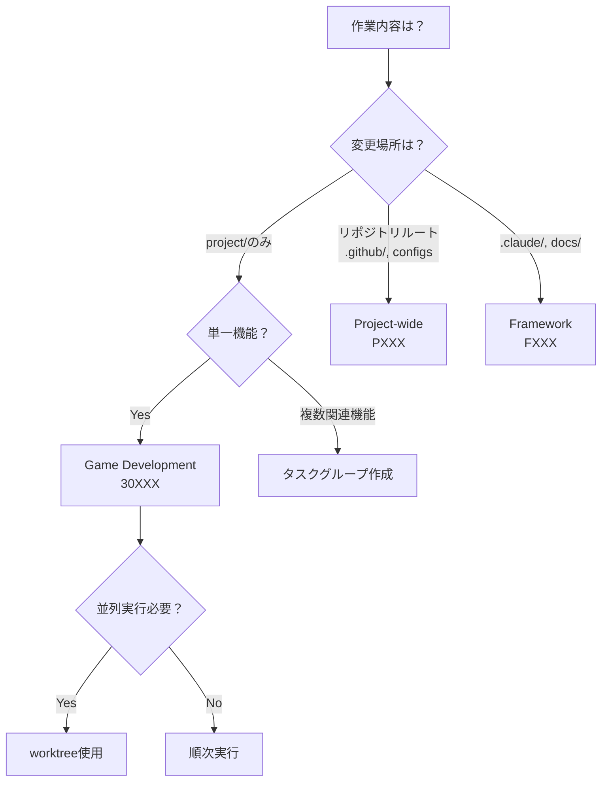
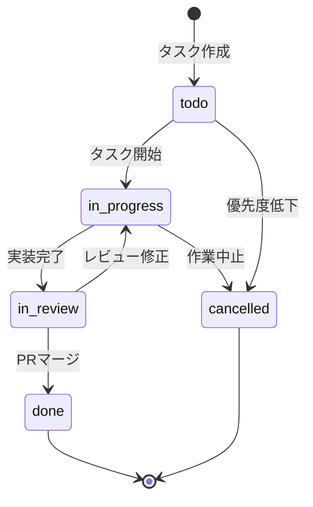

# タスク管理ガイド

Markdown-based task management system の概念とFAQ

---
**対象読者**: タスク管理を使い始める開発者
**所要時間**: 30分
**前提知識**: 基本的なMarkdownとGitの知識

---

## 目次

- [基本概念](#基本概念)
- [タスクタイプ](#タスクタイプ)
- [タスクライフサイクル](#タスクライフサイクル)
- [Worktree統合](#worktree統合)
- [よくある質問（FAQ）](#よくある質問faq)
- [トラブルシューティング](#トラブルシューティング)

---

## 基本概念

### なぜMarkdownベースなのか

このフレームワークでは、タスクを**Markdownファイル**で管理します。

**設計思想:**
- Claude Code がファイルシステムを直接操作できる
- Git で完全にバージョン管理される
- 人間も直接編集できる
- 検索・グレップが容易
- 外部ツール不要

### 従来ツールとの比較

| 観点 | Markdownファイル | GitHub Issues |
|------|-----------------|---------------|
| **Claude Code統合** | 完全自律操作可能 | API経由（制約あり） |
| **バージョン管理** | Git履歴に完全統合 | Issue履歴は別管理 |
| **オフライン動作** | 可能 | 不可 |
| **検索性** | grep/rg/IDE検索 | WebUI検索のみ |
| **並列開発** | worktree統合 | 非対応 |

### 適している用途

- Claude Code を使った単独開発・小規模チーム開発
- 仕様書駆動開発（仕様書とタスクを同一リポジトリで管理）
- worktree による並列開発ワークフロー

---

## タスクタイプ

3つのタスクタイプがあり、対象範囲と worktree 対応が異なります。

| タスク種別 | ID形式 | 配置場所 | worktree | 対象範囲 |
|-----------|-------|---------|---------|---------|
| **ゲーム開発** | `30XXX` | `project/tasks/` | 有効 | `project/` 配下の仕様書・実装 |
| **プロジェクト横断** | `PXXX` | `project/tasks/` | 無効 | リポジトリ全体（CI/CD、インフラ） |
| **フレームワーク** | `FXXX` | `tasks/` | 無効 | `.claude/agents/`, `docs/`, etc. |

### 1. ゲーム開発タスク（game-dev）

**ID形式**: `30XXX`（30000番台）
**配置**: `project/tasks/`
**worktree**: 有効

**対象:**
- `project/docs/` 配下の仕様書作成・更新
- `project/src/` 配下のゲームコード実装
- `project/tests/` 配下のテストコード実装

**例:**
- `30101-プレイヤージャンプ実装.md`
- `30201-敵AI実装.md`

**並列実行:** 可能 - 各タスクが独立したworktreeで作業

### 2. プロジェクト横断タスク（project-wide）

**ID形式**: `PXXX`（P001, P002, ...）
**配置**: `project/tasks/`
**worktree**: 無効

**対象:**
- `.github/workflows/` - CI/CD設定
- リポジトリルートの設定ファイル
- インフラストラクチャ全体に影響する変更

**例:**
- `P001-CI-CD構築.md`
- `P002-Dockerコンテナ化.md`

**並列実行:** 非推奨 - リポジトリ全体に影響するため

### 3. フレームワーク開発タスク（framework）

**ID形式**: `FXXX`（F001, F002, ...）
**配置**: `tasks/`（**注意**: `project/tasks/` ではない）
**worktree**: 無効

**対象:**
- `.claude/agents/` - エージェント定義の更新
- `docs/` - フレームワークドキュメントの更新
- `.claude/commands/` - スラッシュコマンドの追加・修正
- `.claude/skills/` - スキルファイルの更新

**例:**
- `F001-ドキュメント整合性確認.md`
- `F002-タスク管理ドキュメント作成.md`

**並列実行:** 非推奨 - フレームワーク全体に影響するため

### タスクタイプ決定フロー



---

## タスクライフサイクル

### 4つの状態

| 状態 | ディレクトリ | 説明 | 次の状態 |
|-----|------------|------|---------|
| `todo` | `1_todo/` | 未着手。開始待ち。 | `in-progress`, `cancelled` |
| `in-progress` | `2_in-progress/` | 実装中。worktree作成済み。 | `in-review`, `todo`（一時停止）|
| `in-review` | `3_in-review/` | レビュー中。PR作成済み。 | `done`, `in-progress`（修正） |
| `done` | `4_archive/` | 完了。PRマージ済み。 | - |

**重要:**
- タスクは `todo` から開始
- 状態が変わるとファイルが自動的に移動
- `done` と `cancelled` は同じディレクトリ（`4_archive/`）に格納

### ライフサイクル図



### 基本操作フロー

```
1. タスク作成
   「プレイヤーのジャンプ機能のタスクを作成して」
   → task-manager-agent がタスクファイル作成

2. タスク開始
   「タスク30101を開始して」
   → status: todo → in-progress
   → worktree作成（game-devタスクの場合）
   → ファイル移動: 1_todo/ → 2_in-progress/

3. 実装
   「プレイヤーのジャンプ機能を実装して」
   → impl-agent が仕様書に基づいて実装
   → コミット

4. レビュー準備
   「タスク30101をレビュー待ちにして」
   → status: in-progress → in-review
   → ファイル移動: 2_in-progress/ → 3_in-review/
   → PR作成

5. タスク完了
   「タスク30101を完了にして」
   → status: in-review → done
   → ファイル移動: 3_in-review/ → 4_archive/
   → worktree削除（オプション）
```

---

## Worktree統合

### worktreeとは

**Git worktree** は、1つのリポジトリで複数のワーキングディレクトリを持つ Git の機能です。

**通常のGit:**
```
spec-driven-framework/    # 1つのワーキングディレクトリ
└── .git/
```

**worktree使用時:**
```
spec-driven-framework/           # メインワーキングディレクトリ
├── .git/

spec-driven-framework-player/    # 別ワーキングディレクトリ（worktree）
spec-driven-framework-enemy/     # 別ワーキングディレクトリ（worktree）
```

**利点:**
- ブランチ切り替え不要
- 並列作業可能
- コンテキストスイッチ削減
- `.git/` は共有

### 自動管理の仕組み

game-dev タスクのみ worktree が自動作成されます:

```bash
# タスク開始時（game-devタスクの場合）
「タスク30101を開始して」

↓ task-manager-agent が自動実行:

1. ブランチ名生成: auto-{PID}-{feature-name}
2. worktree作成: ../spec-driven-framework-{feature-name}
3. タスクファイル更新
```

### 命名規則

**worktree ディレクトリ名:**
```
../spec-driven-framework-{feature-name}
```

**ブランチ名:**
```
auto-{PID}-{feature-name}
```

---

## よくある質問（FAQ）

### 一般的な質問

#### Q: 手動でタスクファイルを編集してもいいですか？

**A:** はい、可能です。ただし以下に注意してください：
- YAML frontmatterの形式を守る
- `updated_at` を現在時刻に更新する
- 状態を変更した場合、手動でディレクトリ間を移動する

推奨: 状態変更は task-manager-agent に依頼する方が安全です。

#### Q: タスクIDを変更できますか？

**A:** いいえ、変更できません。

理由:
- 他のタスクが `blocked_by` でこのIDを参照している可能性がある
- Git履歴との整合性が失われる

対処法: タスクをキャンセルして新しいIDで作り直す

#### Q: worktreeを使わずにタスクを進められますか？

**A:** はい、可能です。通常のブランチ切り替えで作業できます。ただし並列開発はできません。

#### Q: タスク数に制限はありますか？

**A:** 技術的な制限はありませんが、実用的な推奨値があります。

推奨:
- アクティブタスク（todo/in-progress/in-review）: 10個以下
- 同時進行タスク（in-progress）: 3個以下

#### Q: タスクの優先度を変更できますか？

**A:** はい、タスクファイルの `priority` フィールドを編集してください。

```yaml
priority: "high"  # high, medium, low
```

#### Q: タスクを検索できますか？

**A:** はい、grep/rgで検索できます。

```bash
# grep/rg
grep -r "ジャンプ" project/tasks/
```

### ワークフロー関連

#### Q: タスクはどのタイミングで作成すべきですか？

**A:** 作業を開始する前に、必ず最初にタスクを作成します。

推奨フロー:
```
1. タスク作成（必須：最初のステップ）
2. requirements-agent → spec-agent → critic-agent（仕様策定）
3. design-agent → behavior-agent → test-agent（詳細設計）
4. review-agent（仕様書の整合性確認）
5. impl-agent（実装）
```

#### Q: 複数のin-progressタスクを持てますか？

**A:** 技術的には可能ですが、同時進行タスクは3個以下に抑えることを推奨します。

#### Q: タスクを一時停止できますか？

**A:** はい、可能です。

```bash
# in-progress → todo に戻す
「タスク30101を一時停止して」

# ファイルは自動的に移動: 2_in-progress/ → 1_todo/
# worktreeはそのまま保持される
```

#### Q: 依存関係があるタスクはどう管理しますか？

**A:** `blocked_by` フィールドで依存関係を定義します。

```yaml
# タスク30102: 敵キャラクター実装
---
id: "30102"
title: "敵キャラクター実装"
blocked_by: ["30101"]  # タスク30101が完了するまで開始不可
---
```

### タスクグループ

#### Q: タスクグループとは何ですか？

**A:** 大きなタスクを複数の小さなタスク（子タスク）に分割する機能です。

```
親タスク: 30101 [planning] ジャンプ機能実装
  ├─ 子タスク: 30101-1 [todo] ジャンプ機能-仕様書
  ├─ 子タスク: 30101-2 [todo] ジャンプ機能-実装
  └─ 子タスク: 30101-3 [todo] ジャンプ機能-テスト
```

#### Q: タスクグループはいつ使うべきですか？

**A:** 大きな機能を段階的に実装する場合です。

使うべきケース:
- 仕様策定 → 実装 → テストの順次実行
- 複数のサブシステムを並列実装 + 最後に統合テスト
- 3日以上かかる大きな機能

使わないケース:
- 単純な機能（1-2日で完了）
- 既に仕様書が完成している場合

---

## トラブルシューティング

### "Worktree already exists" エラー

**エラー:**
```
fatal: '../spec-driven-framework-jump' already exists
```

**対処法:**
```bash
# 1. worktree一覧確認
git worktree list

# 2. 既存worktreeを削除
git worktree remove ../spec-driven-framework-jump

# 3. タスクを再開
「タスク30101を開始して」
```

### タスクファイルが見つからない

**エラー:**
```
Error: Task file not found
```

**対処法:**
```bash
# 全ディレクトリを検索
find project/tasks -name "30101-*.md"
```

### "Task blocked by dependencies" エラー

**対処法:**
```bash
# 依存タスクを先に完了させる
「タスク30101を完了にして」

# ブロック解除を確認
「タスク30102を開始して」
```

### タスクファイルのYAMLがパースエラーになる

**チェックポイント:**
- インデントはスペース2つ
- 文字列はダブルクォート `"..."` で囲む
- リストは `["item1", "item2"]` 形式
- booleanは `true`/`false`（クォート不要）
- nullは `null`（クォート不要）

**正しい例:**
```yaml
---
id: "30101"
title: "ジャンプ機能実装"
type: "game-dev"
status: "in-progress"
priority: "high"
spec_ids: ["30201", "30202"]
blocked_by: []
blocks: []
branch_name: "auto-12345-jump-feature"
worktree_path: "../spec-driven-framework-jump"
plan_file: null
tags: ["player", "physics"]
created_at: "2025-12-29T10:00:00.000000"
updated_at: "2025-12-29T11:30:00.000000"
completed_at: null
---
```

---

## ベストプラクティス

### タスクの粒度

**1タスク = 半日〜2日** が目安です。

- 細かすぎる（NG）: 1時間以下で完了するタスク
- 適切: 半日〜2日で完了するタスク
- 粗すぎる（NG）: 1週間以上かかるタスク

### 並列開発の推奨タスク数

**3つ以下** を推奨します。

```
Terminal 1: プレイヤー実装
Terminal 2: 敵実装
Terminal 3: ステージ実装

→ 合計3タスク（管理可能）
```

### コミットメッセージ

**[タスクID] prefix: 変更内容** の形式を推奨します。

```
[30101] feat: ジャンプ機能実装
[30101] fix: ジャンプ高度の調整
```

### worktreeのクリーンアップ

タスク完了直後、またはPRマージ後にクリーンアップします。

```bash
# 1. PRマージ
# 2. タスク完了（status: done）
# 3. worktree削除
git worktree remove ../spec-driven-framework-jump
# 4. ブランチ削除
git branch -d auto-12345-jump-feature
```

---

## タスク状況表示

### 出力形式

タスク状況を表示する際の標準形式です。

#### アイコン定義

| ステータス | アイコン | 説明 |
|-----------|---------|------|
| todo | ⬜ | 未着手 |
| in-progress | 🔄 | 進行中 |
| in-review | 👁️ | レビュー待ち |
| done | ✅ | 完了 |
| cancelled | ❌ | キャンセル |

| 優先度 | アイコン |
|-------|---------|
| high | 🔴 |
| medium | 🟡 |
| low | 🟢 |

#### 出力例

```
===================================
タスク状況
===================================

🔄 🔴 [30101] ジャンプ機能実装 (game-dev)
⬜ 🟡 [30102] 敵キャラクターAI実装 (game-dev)
👁️ 🔴 [30103] ステージ構築 (game-dev)
⬜ 🟡 [P001] CI/CD構築 (project-wide)

===================================
統計
===================================
合計: 4
⬜ Todo: 2
🔄 In Progress: 1
👁️ In Review: 1
```

#### フィルタオプション

| オプション | 説明 |
|-----------|------|
| `--type game-dev` | タイプでフィルタ |
| `--status in-progress` | ステータスでフィルタ |
| `--priority high` | 優先度でフィルタ |
| `--all` | done/cancelled も含む |
| `--verbose` | 詳細表示（spec_ids, worktree等） |

### 使用例

#### 作業開始時

```
ユーザー: 「タスクの状況を教えて」

===================================
タスク状況
===================================

🔄 🔴 [30101] ジャンプ機能実装 (game-dev)
⬜ 🟡 [30102] 敵キャラクターAI実装 (game-dev)

ユーザー判断:
- タスク30101を続行するか
- タスク30102を開始するか
```

#### 詳細表示モード

```
===================================
タスク状況（詳細）
===================================

🔄 🔴 [30101] ジャンプ機能実装 (game-dev)
  仕様書: 30201, 30202
  ブロック: 30102
  worktree: ../spec-driven-framework-jump
  ブランチ: auto-12345-jump-feature
```

<details>
<summary>参考実装（シェルスクリプト）</summary>

以下はタスク状況を表示するシェルスクリプトの参考実装です。実際には Claude Code が Glob/Read ツールを使用して同等の処理を行います。

```bash
#!/bin/bash
# タスク状況表示

TASKS_DIR="project/tasks"

# タスクファイル収集（archive以外）
TASK_FILES=$(find "$TASKS_DIR" -name "*.md" -not -path "*/4_archive/*" | sort)

echo "==================================="
echo "タスク状況"
echo "==================================="
echo ""

# 統計情報
TODO_COUNT=0
IN_PROGRESS_COUNT=0
IN_REVIEW_COUNT=0

# タスク表示
for FILE in $TASK_FILES; do
  # Frontmatter解析
  ID=$(grep '^id:' "$FILE" | sed 's/id: "\(.*\)"/\1/')
  TITLE=$(grep '^title:' "$FILE" | sed 's/title: "\(.*\)"/\1/')
  TYPE=$(grep '^type:' "$FILE" | sed 's/type: "\(.*\)"/\1/')
  STATUS=$(grep '^status:' "$FILE" | sed 's/status: "\(.*\)"/\1/')
  PRIORITY=$(grep '^priority:' "$FILE" | sed 's/priority: "\(.*\)"/\1/')

  # カウント更新
  case $STATUS in
    todo) TODO_COUNT=$((TODO_COUNT + 1)) ;;
    in-progress) IN_PROGRESS_COUNT=$((IN_PROGRESS_COUNT + 1)) ;;
    in-review) IN_REVIEW_COUNT=$((IN_REVIEW_COUNT + 1)) ;;
  esac

  # アイコン設定
  case $STATUS in
    todo) STATUS_ICON="⬜" ;;
    in-progress) STATUS_ICON="🔄" ;;
    in-review) STATUS_ICON="👁️" ;;
    done) STATUS_ICON="✅" ;;
    cancelled) STATUS_ICON="❌" ;;
  esac

  case $PRIORITY in
    high) PRIORITY_ICON="🔴" ;;
    medium) PRIORITY_ICON="🟡" ;;
    low) PRIORITY_ICON="🟢" ;;
  esac

  echo "$STATUS_ICON $PRIORITY_ICON [$ID] $TITLE ($TYPE)"
done

# 統計表示
echo ""
echo "==================================="
echo "統計"
echo "==================================="
echo "⬜ Todo: $TODO_COUNT"
echo "🔄 In Progress: $IN_PROGRESS_COUNT"
echo "👁️ In Review: $IN_REVIEW_COUNT"
```

</details>

---

## 関連ドキュメント

- [task-workflow.md](../../.claude/skills/task-workflow.md) - Claude用スキル索引
- [task-status.md](../../.claude/skills/task-status.md) - タスク状況表示形式（Claude用）
- [task-lifecycle.md](../../.claude/skills/task-lifecycle.md) - タスク状態遷移（Claude用）
- [parallel-sessions.md](../../.claude/skills/parallel-sessions.md) - 並列セッション実行ガイド
