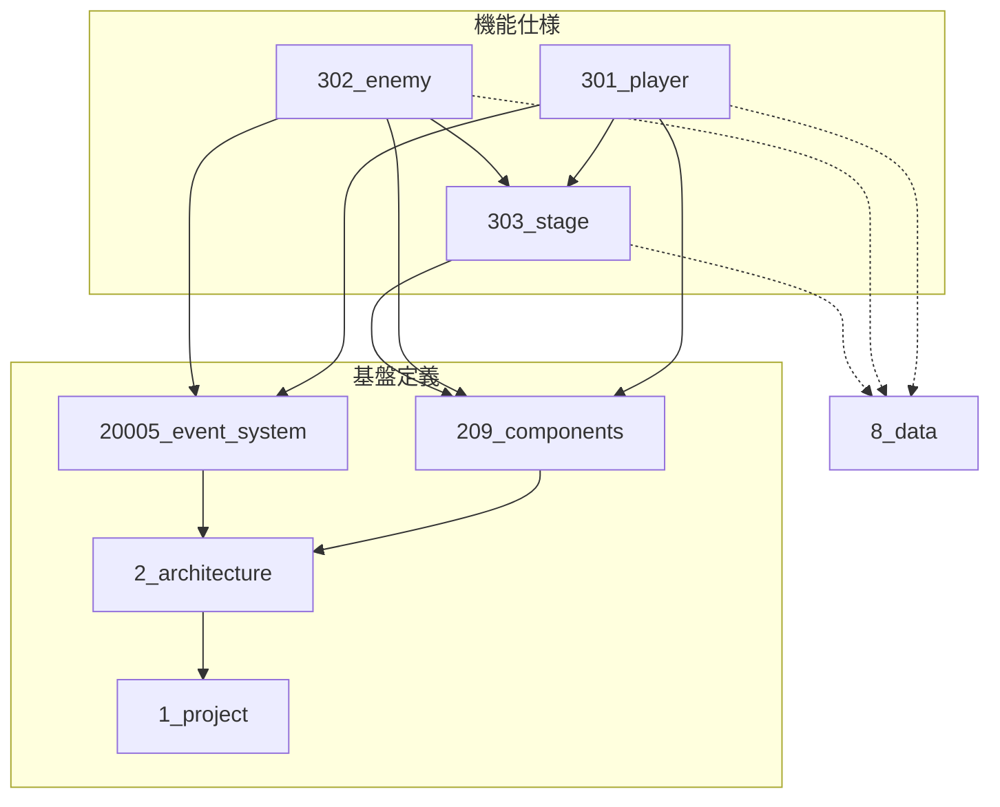

# 仕様書駆動開発フレームワーク

## 概要

Claude Code を使用した、**Godot + C#** による2Dアクションゲーム開発向け仕様書駆動フレームワーク。ECSアーキテクチャを前提とし、エンジン非依存の設計により Unity への移植も容易にする。仕様書を唯一の真実の源（Single Source of Truth）として扱う。

---

**対象読者**: フレームワークのコア仕様を必要とする開発者
**所要時間**: 60分（コア仕様のみ）
**前提知識**: ECSアーキテクチャ、Claude Code中級以上、Git/GitHubワークフロー
**次に読むべき**: [仕様書執筆ガイド](./spec-writing-guide.md)、[ツールリファレンス](./tools-reference.md)

---

## 技術スタック

### 対象エンジン

本フレームワークは **Godot** を対象とします。

ただし、エンジン依存を極力避けた設計により、**Unity への移植を容易** にすることを重視します。

### 対象言語

- **C#**

### ECS実装

Godot の標準ECSまたはサードパーティECSライブラリを使用します。

### 設計思想

- **エンジン非依存**: コア仕様・仕様書構造はエンジンに依存しない
- **移植性**: Godot → Unity への移植を容易にする設計
- **実装の分離**: エンジン固有のコードは Presentation Layer に閉じ込める

これにより、将来的に Unity への移植が必要になった場合でも、Core/Component/System Layer の大部分を再利用できます。

---

## 対象読者

このフレームワークは以下の経験を持つ開発者を対象とします。

### 必須スキル（これがないと使えません）

- ✅ **ECSアーキテクチャの理解**: Godot ECS または Unity DOTS での実装経験
- ✅ **Claude Code 中級以上**: サブエージェント、Task tool の使用経験
- ✅ **Git/GitHub ワークフロー**: ブランチ戦略、PR運用の理解

### 推奨スキル（あると学習が早い）

- ✅ 形式手法への理解: EARS記法、Design by Contract
- ✅ 依存関係管理の経験: 禁止依存、レイヤーアーキテクチャ
- ✅ AIペアプログラミングでの失敗経験: AIの暴走、仕様の乖離

### このフレームワークが解決する問題

本フレームワークは、以下の痛みを経験した開発者のために設計されています：

- ❌ **AIエージェントが勝手に機能を追加する**
  - 仕様書にない実装を防ぐガードレールを提供

- ❌ **仕様とコードの乖離**
  - `@spec` コメントによる双方向トレーサビリティ

- ❌ **テストと要件の関係が不明**
  - TST-ID と REQ-ID の明示的リンク

- ❌ **複数機能の並行開発での競合**
  - 並列セッション管理による競合の最小化

### このフレームワークが解決しない問題

以下は本フレームワークの範囲外です：

- ❌ ゲーム開発の学習コスト
- ❌ ECSアーキテクチャの理解
- ❌ プログラミングスキルの不足
- ❌ ゲームデザインの創造性

### 学習コスト

初回セットアップ時に **6-8時間** の学習時間が必要です：

- 番号体系の理解: 30分
- EARS記法の習得: 1時間
- エージェントの役割把握: 2時間
- 並列セッション管理: 1時間
- 実装コメント規約: 30分
- 総合練習: 2時間

詳細は「ミニマムスタート」セクションを参照。

---

### 本ドキュメントの配置

このフレームワーク仕様書（spec-vX.X.md）は以下のいずれかに配置する:
- プロジェクトルート直下
- `docs/` の外（例: `framework/spec.md`）

**注意**: `docs/` 内に配置すると番号体系と競合するため非推奨

---

## 開発原則

### タスク優先原則

**すべての変更作業は、必ずタスク作成から開始します。**

**基本フロー:**
```
作業依頼 → タスク作成 → 仕様書作成/変更 → 実装 → タスク完了
```

**適用範囲:**
- 新機能開発（Player、Enemy、Stage等）
- バグ修正（実装バグ、仕様バグ両方）
- 仕様変更（要件追加、設計変更）
- リファクタリング
- ドキュメント更新（仕様書）

**この原則の理由:**
- 作業の追跡可能性（タスクIDでトレース）
- 並列セッション管理（worktree/ブランチ自動作成）
- 依存関係の事前管理（blocked_by/blocks）
- 作業完了の明確化（done状態）

詳細: [クイックスタート](../tutorials/quickstart.md)、[タスク管理](../concepts/tasks.md)

#### タスクProgress/Next Actions管理

**タスクの進捗と次のアクションを明示的に管理します。**

**Progressセクション:**
- タイムスタンプ付きで作業履歴を記録
- 重要なマイルストーン（Phase完了、コミット等）を記録
- エージェント作業完了時に自動更新

**Next Actionsセクション:**
- 次に何をすべきかを明確化
- 作業完了後、次のステップが明確な場合に更新
- レビューで問題検出時に修正タスクリストを自動生成

**記録方法:**
- Claude Code がタスクファイルの `## Progress` セクションを直接編集
- `## Next Actions` セクションも同様に直接編集

**自動化:**
- impl-agent: コミット後にProgress自動記録
- review-agent: レビュー後にProgress/Next Actions自動更新

詳細: [タスクワークフロー](../../.claude/skills/task-workflow.md#progress-と-next-actions-の管理)

### 仕様書駆動原則

**タスク作成後、実装は必ず仕様書に基づいて行います。**

```
仕様書（spec.md） → 実装（src/） → テスト（tests/）
```

- **全ての実装は仕様書に基づく**: 仕様書にない機能は絶対に実装しない
- **仕様書を先に更新**: 実装前に必ず仕様書を更新する
- **EARS記法を使用**: 要件記述は EARS記法で明確に定義
- **対応コメント必須**: 実装時は `@spec`/`@data` コメントを必ず付与

詳細: [仕様書執筆ガイド](spec-writing-guide.md)

---

## ミニマムスタート

初期は以下の最小構成で開始し、必要に応じて拡張:

```
docs/
├── 1_project/
│   └── 10001_concept.md      # ゲームの核心を1ページで
└── 3_ingame/
    └── 301_player/
        ├── 30101_player_spec.md
        └── 30102_player_design.md
```

**拡張タイミング**:
- 2つ目の機能を作るとき → `20002_dependencies.md` を追加
- 共有Componentが必要になったとき → `209_components/` を追加
- データテーブルが必要になったとき → `8_data/` を追加

---

## ディレクトリ構成

```
CLAUDE.md
.claudeignore

agents/
├── requirements-agent.md
├── spec-agent.md
├── critic-agent.md
├── design-agent.md
├── behavior-agent.md
├── test-agent.md
├── architecture-agent.md
├── impl-agent.md
├── review-agent.md
├── deps-agent.md
├── refactor-agent.md
├── data-agent.md
├── setup-agent.md
├── legacy-analyzer-agent.md
└── game-reference-agent.md

commands/
├── id.md
├── id-list.md
├── id-refs.md
├── id-next.md
├── docs-validate.md
├── docs-summary.md
├── docs-history.md
├── deps-check.md
├── deps-graph.md
├── vibe-status.md
├── component-share.md
└── status.md

skills/
├── ears.md
├── impl-comments.md
└── extraction-schema.md

docs/
├── 1_project/
│   ├── 10000_overview.md
│   ├── 10001_concept.md
│   ├── 10002_gdd.md
│   ├── 10003_tech_stack.md
│   └── 10004_conventions.md
│
├── 2_architecture/
│   ├── 20000_overview.md
│   ├── 20001_layers.md
│   ├── 20002_dependencies.md
│   ├── 20003_game_flow.md
│   ├── 20004_ecs_overview.md
│   ├── 20005_event_system.md
│   ├── 20006_input_system.md
│   ├── 20007_assets.md
│   ├── 208_templates/
│   │   ├── 20800_templates_overview.md
│   │   ├── 20801_template_spec.md
│   │   ├── 20802_template_design.md
│   │   ├── 20803_template_behavior.md
│   │   └── 20804_template_test.md
│   └── 209_components/
│       ├── 20900_components_overview.md
│       ├── 20901_transform.md
│       ├── 20902_health.md
│       └── ...
│
├── 3_ingame/
│   ├── 30000_overview.md
│   ├── 301_player/
│   │   ├── 30100_player_overview.md
│   │   ├── 30101_player_spec.md
│   │   ├── 30102_player_design.md
│   │   ├── 30103_player_behavior.md
│   │   └── 30104_player_test.md
│   ├── 302_enemy/
│   │   └── ...
│   └── 303_stage/
│       └── ...
│
├── 4_outgame/
│   ├── 40000_overview.md
│   ├── 401_title/
│   │   └── ...
│   └── 402_save_load/
│       └── ...
│
├── 8_data/
│   ├── 80000_overview.md
│   └── 801_tables/
│       ├── 80100_tables_overview.md
│       └── 80101_enemy_params.md
│
└── _deprecated/
    └── (廃止された機能)
```

---

## 番号体系

### 早見表（よく使うパターン）

| パス | ファイル番号 |
|------|-------------|
| 1_project/concept | 10001 |
| 2_architecture/layers | 20001 |
| 2_architecture/209_components/transform | 20901 |
| 3_ingame/301_player/spec | 30101 |
| 3_ingame/301_player/design | 30102 |
| 3_ingame/301_player/behavior | 30103 |
| 3_ingame/301_player/test | 30104 |
| 3_ingame/302_enemy/spec | 30201 |
| 4_outgame/401_title/spec | 40101 |
| 8_data/801_tables/enemy_params | 80101 |

### 5桁番号の構成

```
[AAA][BB]

AAA : フォルダ番号（3桁: 親番号 × 100 + サブフォルダ番号）
BB  : ファイル種別番号（2桁: 00-99）
```

### フォルダ番号の計算ルール

```
フォルダ番号 = 親番号(1桁) × 100 + サブフォルダ番号(2桁)
```

| ディレクトリ | 親番号 | サブフォルダ番号 | フォルダ番号 |
|---|---|---|---|
| 1_project/ | 1 | 00 | 100 |
| 2_architecture/ | 2 | 00 | 200 |
| 208_templates/ | 2 | 08 | 208 |
| 209_components/ | 2 | 09 | 209 |
| 3_ingame/ | 3 | 00 | 300 |
| 301_player/ | 3 | 01 | 301 |
| 302_enemy/ | 3 | 02 | 302 |
| 303_stage/ | 3 | 03 | 303 |
| 4_outgame/ | 4 | 00 | 400 |
| 401_title/ | 4 | 01 | 401 |
| 402_save_load/ | 4 | 02 | 402 |
| 8_data/ | 8 | 00 | 800 |
| 801_tables/ | 8 | 01 | 801 |

**注意**: 親フォルダ直下のファイル（サブフォルダなし）は `サブフォルダ番号 = 00` として計算する。

**制約**: サブフォルダ番号は **01〜99** を使用する。00 は親フォルダ直下のファイル群のために予約されており、`300_xxx/` のような `サブフォルダ番号 = 00` のフォルダは **作成禁止**。

```
3_ingame/
├── 30000_overview.md      # 親3, サブ00 → OK（親フォルダ直下）
├── 300_common/            # NG! サブフォルダ番号00は禁止
├── 301_player/            # OK（サブフォルダ番号01）
└── 302_enemy/             # OK（サブフォルダ番号02）
```

### ネスト制限

サブフォルダは **2階層まで** とする。

```
docs/
├── 3_ingame/           # 第1階層（親）
│   └── 301_player/     # 第2階層（サブ）← ここまで許可
│       └── NG/         # 第3階層 ← 禁止
```

3階層目が必要と感じた場合は、機能の分割を検討する。

### 1フォルダ1機能セットの原則

**原則**: 1つのサブフォルダには、1つの機能セット（overview, spec, design, behavior, test）のみを配置する。

機能が複雑化した場合は、同一フォルダ内に複数の spec/design を作るのではなく、フォルダを分割する:

```
NG: 301_player/ 内に 30105_player_input_spec.md を追加
OK: 301_player_movement/, 304_player_combat/ のようにフォルダを分ける
```

**理由**:
- ファイル番号（xx01-xx04）と機能セットの1対1対応を維持
- 番号体系の予測可能性を保つ

### ファイル種別番号（機能仕様層）

| 種別 | 番号 | 責務 |
|---|---|---|
| overview | 00 | 概要・目次 |
| spec | 01 | 要件定義（何を満たすべきか） |
| design | 02 | データ構造定義（何を持つか） |
| behavior | 03 | ロジック定義（どう動くか） |
| module | 04 | モジュール設計（設計パターン選択） |
| test | 05 | テストシナリオ |
| （予約） | 06-99 | 将来拡張用 |

**ルール**:
- 機能仕様層（3, 4）: 上記の固定番号を使用
- 基盤定義層（1, 2, 8）: 連番でトピックごとに割り当て（00 も連番の一部として扱う）

### 計算例

| ファイル | フォルダ番号 | 種別 | 結果 |
|---|---|---|---|
| 1_project/ の concept | 100 | 01 | 10001 |
| 1_project/ の gdd | 100 | 02 | 10002 |
| 2_architecture/ の layers | 200 | 01 | 20001 |
| 208_templates/ の spec | 208 | 01 | 20801 |
| 301_player/ の spec | 301 | 01 | 30101 |
| 301_player/ の design | 301 | 02 | 30102 |
| 301_player/ の behavior | 301 | 03 | 30103 |
| 301_player/ の module | 301 | 04 | 30104 |
| 301_player/ の test | 301 | 05 | 30105 |

### 親フォルダ番号割り当て

| 番号 | 用途 | グループ |
|---|---|---|
| 1 | project | 基盤定義 |
| 2 | architecture | 基盤定義 |
| 3 | ingame | 機能仕様 |
| 4 | outgame | 機能仕様 |
| 5 | （予約: multiplayer等） | 機能拡張用 |
| 6 | （予約: debug_tools等） | 機能拡張用 |
| 7 | （予約） | 機能拡張用 |
| 8 | data | 支援層 |

### タスクID体系

タスクには以下のID体系を使用します。

| タイプ | 形式 | 例 | 説明 |
|--------|------|-----|------|
| 機能実装 | `30XXX` | 30101 | 新機能の実装 |
| バグ修正 | `B30XXX-NNN` | B30101-001 | 既存機能のバグ修正 |
| リファクタ | `R30XXX-NNN` | R30101-001 | 既存機能の改善・最適化 |
| フレームワーク | `FXXX` | F012 | フレームワーク開発 |
| プロジェクト横断 | `PXXX` | P003 | CI/CD、インフラ等 |

**バグ修正/リファクタタスクの利点**:
- 機能IDを消費しない（枯渇防止）
- 元機能との関連が明確（B30101 → 30101）
- 統計・分析が容易（どの機能にバグが多いか）

**配置先**:
- `FXXX` → `tasks/`
- `30XXX`, `B30XXX-NNN`, `R30XXX-NNN`, `PXXX` → `project/tasks/`

**worktree対応**:
- `30XXX`, `B30XXX-NNN`, `R30XXX-NNN` → ✅ 有効
- `FXXX`, `PXXX` → ❌ 無効

---

## フェーズ管理（MVP/バージョン管理）

### 概要

複数のバージョン（MVP v0.1、v0.2、v0.3...）にまたがる機能開発において、**仕様書には全バージョンの要件を記載し、実装スコープは別途管理する**方式を採用します。

### 設計原則

1. **仕様書は完全な姿を記述** - 将来のバージョンも含めて全要件を記載
2. **セクション分離** - MVP / v0.2 / v0.3+ でセクションを分ける
3. **スコープ文書で管理** - 実装対象は mvp_scope.md で一元管理
4. **実装時の保護** - impl-agent が誤ってフェーズ2を実装しないようガードレール設置

### 3層フェーズ管理

| レイヤー | ドキュメント | 管理単位 | 目的 |
|---------|-------------|---------|------|
| **1. 機能レベル** | `30009_mvp_scope.md` | 機能単位 | どの機能がMVP対象か |
| **2. 要件レベル** | 各`spec.md`内 | REQ-ID単位 | 各機能内のどの要件がMVP対象か |
| **3. 実装保護** | CLAUDE.md, エージェント | 実装時 | 誤実装の防止 |

---

### セクション分離方式

各 spec.md は以下の構造を持ちます：

```markdown
# [機能名] Specification

## 概要
...

## Core Requirements (MVP v0.1)

### REQ-30601-001: ショット入力
**WHEN** プレイヤーがBボタンを押す
...

### REQ-30601-006: ShotEvent の発行
...

---

## Extended Requirements (v0.2)

### REQ-30601-010: ボタン長押し（強さ調整）
**WHEN** プレイヤーがBボタンを長押しする
**THE SYSTEM SHALL** 長押し時間に応じてショット強度を調整する
...

### REQ-30601-011: 必殺ショット判定
...

---

## Future Requirements (v0.3+)

### REQ-30601-020: スピンショット
...
```

### ID番号の慣習

厳密なルールではなく、緩やかな慣習として以下を推奨：

| REQ-ID範囲 | 用途 |
|-----------|------|
| 001-049 | MVP v0.1 |
| 050-099 | v0.2 |
| 100-149 | v0.3+ |

**注意**: この範囲は柔軟に調整可能。ID不足時は柔軟に対応してください。

---

### mvp_scope.md の役割

`3_ingame/30009_mvp_scope.md` または `4_outgame/40009_mvp_scope.md` で以下を管理：

1. **完成定義** (Definition of Done)
2. **含む機能・含まない機能** (機能レベル)
3. **実装対象REQ-ID一覧** (要件レベル)

#### 例: REQ-ID一覧

```markdown
## 実装対象REQ-ID一覧（MVP v0.1）

### 306_shot_system
- **30601_shot_input_spec.md**: REQ-30601-001 ~ 006
- **30602_shot_direction_spec.md**: REQ-30602-001 ~ 003
- **30603_jump_shot_spec.md**: REQ-30603-001 ~ 002

### 307_scoring
- **30701_point_spec.md**: REQ-30701-001 ~ 005
- **30702_game_spec.md**: REQ-30702-001 ~ 003
- **30703_set_spec.md**: REQ-30703-001 ~ 002
```

---

### 実装時の保護策

#### 1. impl-agent へのプロンプト（CLAUDE.mdに記載）

```markdown
## 実装時のフェーズ管理

**CRITICAL**: MVP v0.1の実装時は、以下を遵守してください：

1. spec.md内の「Core Requirements (MVP v0.1)」セクションのみを実装
2. 「Extended Requirements」セクションは実装しない
3. 実装前に `30009_mvp_scope.md` で対象REQ-IDを確認
4. MVP外のIDに対する `@spec` コメントは禁止
```

#### 2. review-agent による検証

`/impl-validate` コマンドを拡張し、以下をチェック：

- 実装コメント `@spec REQ-xxx-050` 以降を参照していないか警告
- mvp_scope.md の対象REQ-ID範囲外を実装していないか検証

#### 3. ドキュメントレビュー

- 仕様書レビュー時に「Core Requirements」セクションが存在するか確認
- MVP対象外の要件が誤って「Core Requirements」に含まれていないか確認

---

### メリット

1. **全体像の把握** - MVP実装中も将来の拡張が見える
2. **設計の一貫性** - MVP実装時に「これは後でやる」と明確に区別できる
3. **柔軟性** - v0.2の詳細は後で詰めても良い（まずは大枠のみ）
4. **誤実装防止** - impl-agent が誤ってv0.2要件を実装するリスクを低減

---

### デメリットと対策

| デメリット | 対策 |
|----------|------|
| 仕様書が長くなる | セクション分離で見やすさを維持 |
| 実装時に混乱 | mvp_scope.md で明確化 + エージェントへのプロンプト |
| 2箇所管理の手間 | 一度の仕様策定で全バージョンを記載 → 後は実装のみ |

---

### ワークフロー例

#### Phase A: 仕様策定（全バージョン）

1. 各 spec.md に「Core Requirements (MVP)」「Extended Requirements (v0.2)」を記載
2. `30009_mvp_scope.md` でMVP対象REQ-IDを明記
3. 仕様書レビュー・整合性チェック

#### Phase B: MVP実装

1. impl-agent は「Core Requirements」セクションのみを参照
2. 実装完了後、review-agent でフェーズ外実装がないか検証

#### Phase C: v0.2実装（MVP完了後）

1. `30009_mvp_scope.md` を `30010_v02_scope.md` にコピー・更新
2. impl-agent は「Extended Requirements」セクションを参照
3. 同様に実装・検証

---

## 各層の責務

### 1_project/（プロジェクト定義）

| ファイル | 内容 |
|----------|------|
| 10000_overview.md | プロジェクト全体の概要 |
| 10001_concept.md | ゲームコンセプト |
| 10002_gdd.md | ゲームデザインドキュメント |
| 10003_tech_stack.md | 技術スタック |
| 10004_conventions.md | コーディング規約 |

### 2_architecture/（アーキテクチャ定義）

| ファイル | 内容 |
|----------|------|
| 20000_overview.md | アーキテクチャ全体の概要 |
| 20001_layers.md | レイヤー構成 |
| 20002_dependencies.md | 依存関係図・依存ルール |
| 20003_game_flow.md | ゲームフロー |
| 20004_ecs_overview.md | ECSアーキテクチャ概要 |
| 20005_event_system.md | イベントシステム設計、Entity間相互作用パターン |
| 20006_input_system.md | 入力システム |
| 20007_assets.md | アセット管理 |

#### 208_templates/（仕様書テンプレート）

| ファイル | 内容 |
|----------|------|
| 20800_templates_overview.md | テンプレート一覧・使い方 |
| 20801_template_spec.md | spec テンプレート |
| 20802_template_design.md | design テンプレート |
| 20803_template_behavior.md | behavior テンプレート |
| 20804_template_test.md | test テンプレート |

#### 209_components/（共有Component定義）

| ファイル | 内容 |
|----------|------|
| 20900_components_overview.md | 共有Component一覧・方針 |
| 20901_transform.md | 位置・回転・スケール |
| 20902_health.md | HP・ダメージ関連 |
| ... | 2機能以上で使用するComponent |

### 3_ingame/, 4_outgame/（機能仕様）

各機能フォルダ内のファイル構成:

| ファイル | 内容 |
|---|---|
| xxxxx_[機能]_overview | 機能の目的、関連機能（省略可） |
| xxxxx_[機能]_spec | 要件定義（EARS記法）、制約条件（DbC） |
| xxxxx_[機能]_module | モジュール設計、設計パターン選択 |
| xxxxx_[機能]_design | データ構造、インターフェース定義 |
| xxxxx_[機能]_behavior | 状態遷移、ロジック、アルゴリズム |
| xxxxx_[機能]_test | BDD形式テストシナリオ |

#### 3_ingame/ と 4_outgame/ の設計特性

| 観点 | インゲーム (3_ingame/) | アウトゲーム (4_outgame/) |
|------|----------------------|-------------------------|
| 更新頻度 | 毎フレーム（60FPS） | イベント駆動 |
| 状態管理 | ECS / Component | 画面状態マシン |
| 主な設計パターン | Factory, Strategy, Observer | State, Command, MVC的構造 |
| テスト重視点 | シミュレーション、境界値 | 画面遷移、入力フロー |
| 拡張の方向 | 新エンティティ、新System | 新画面、新機能メニュー |
| パフォーマンス | クリティカル | 比較的余裕あり |

##### インゲーム設計の指針
- ECS原則を厳守（ComponentはデータのみSystemはステートレス）
- Entity間の直接参照を避け、EventSystem経由
- パラメータはデータ駆動（8_data/ 参照）
- 種類が増える要素（敵、武器、アイテム等）は Factory + Strategy パターンを検討

##### アウトゲーム設計の指針
- 画面単位でのモジュール分離
- 画面遷移は状態マシンで管理（behavior.md で定義）
- ゲームデータとの接続点を明確に（セーブ/ロード、設定等）
- UIフローは Command パターンを検討（Undo/Redo対応時）

##### 共有レイヤー（2_architecture/ で定義）
以下はインゲーム/アウトゲームの両方から参照される共有サービス:
- **GameStateManager**: インゲーム/アウトゲームの切り替え
- **EventSystem**: 両者間の疎結合な通信
- **DataLoader**: 設定・セーブデータの読み書き
- **AudioManager**: BGM/SE管理
- **InputManager**: 入力管理

#### overview.md の省略

機能フォルダ内の overview.md は省略可能。省略した場合、spec.md 冒頭の Overview セクションが目次を兼ねる。

**必須のまま維持するケース**:
- 親フォルダ直下の overview.md（層全体の目次）
- 関連 Issue が多く、spec.md に書くと冗長になる場合

### 8_data/（データ定義）

| サブフォルダ | 内容 |
|---|---|
| 801_tables/ | マスタテーブル（複数バリエーションを持つデータ） |

#### データファイル形式

**Markdown表形式**（推奨）:

```markdown
# Enemy Parameters

## 概要
敵キャラクターの基本パラメータ定義

## テーブル

| ID | Name | HP | Attack | Speed | Description |
|---|---|---|---|---|---|
| enemy_slime | スライム | 10 | 2 | 1.0 | 最弱の敵 |
| enemy_goblin | ゴブリン | 25 | 5 | 1.5 | 序盤の標準敵 |
| enemy_orc | オーク | 50 | 10 | 1.2 | 中盤の強敵 |
```

**命名規則**: `8XXYY_[テーブル名].md`
- XX: サブフォルダ番号
- YY: テーブル連番

**参照方法**: 仕様書から表のIDで参照

```markdown
### REQ-30201-001: スライムの出現
- WHEN プレイヤーがエリア1に入る
- THE SYSTEM SHALL スライムを生成する
- WITH パラメータ: [enemy_slime](../../8_data/801_tables/80101_enemy_params.md)
```

#### テーブル間参照

テーブル間で参照が必要な場合、IDで参照する:

```markdown
| ID | Name | SkillID |
|---|---|---|
| enemy_goblin | ゴブリン | skill_slash |

参照先: [80102_skills.md](./80102_skills.md)
```

**ルール**:
- 参照は ID 列の値で行う
- 参照先テーブルへのリンクをコメントまたは備考に記載

#### データの利用方法

**基本方針（手動管理）**
- Markdown表を参照しながら、コード内で定数または設定ファイルとして定義
- データ変更時は仕様書を先に更新し、その後コードを修正

**注意**: 8_data/ は参照資料であり、コードへの転記は手動で行う。

**運用例**
```csharp
// @data 80101_enemy_params.md#enemy_slime
public static readonly EnemyParam Slime = new(hp: 10, attack: 2, speed: 1.0f);
```

**将来的な拡張**
データ量が増加した場合、以下の選択肢を検討:
- Markdown → JSON/YAML 変換スクリプトの導入
- ScriptableObject（Unity）/ tres/resファイル（Godot）への移行

**注**: 共有Component定義は `2_architecture/209_components/` に配置。`8_data/` は純粋に「値」のみを扱う。

---

## 依存関係

### 層間の依存ルール

上位層から下位層への参照のみ許可。逆方向は禁止。

```
1_project（参照されるのみ）
    ↑
2_architecture
    ↑
3_ingame / 4_outgame

────────────────────────────
8_data（独立層・全層から横断的に参照可・他層を参照しない）
```

### 機能間の依存図

凡例:
- 実線（-->）: 依存関係（矢印の向き = 依存する側 → 依存される側）
- 破線（-.->）: データ参照（8_data への横断参照）
- **8_data は参照される専用**（他層を参照しない）



**依存の補足**:
- Player/Enemy → Stage: 地形判定・当たり判定のため

### Player ↔ Enemy の相互作用

Player と Enemy は **直接参照しない**。衝突判定などの相互作用は EventSystem 経由で実現する。

詳細な実装パターンは [20005_event_system.md](./20005_event_system.md#entity-interaction-pattern) を参照。

### 禁止されている依存

| 依存 | 理由 |
|------|------|
| Player ↔ Enemy | 直接参照禁止、EventSystem経由で疎結合化 |
| Stage → Player / Enemy | Stageはエンティティの存在を知らない |
| 3_ingame ↔ 4_outgame | 相互参照禁止 |
| 8_data → 他層 | データ層は参照される専用 |

### 注意が必要な依存

| 依存 | 注意点 |
|------|--------|
| Player, Enemy → EventSystem | イベント設計は 20005_event_system.md で一元管理 |

### 運用ルール

- 新規機能追加時: 依存図に追加し、禁止ルールに抵触しないか確認
- `/deps-check`: 禁止ルール違反を検出
- `/deps-graph`: Mermaid図を再生成

---

## エージェント・コマンド・Skills（簡潔版）

### エージェント一覧

タスクに応じて専門エージェントが対応します。

| アイコン | エージェント | 責務 | 主な成果物 | 詳細 |
|---------|-------------|------|-----------|------|
| 💬 | requirements-agent | 対話で要件を深掘り・固める | 要件サマリ | [定義](../../.claude/agents/requirements-agent.md) |
| 📋 | spec-agent | EARS記法で要件を文書化 | spec.md | [定義](../../.claude/agents/spec-agent.md) |
| 🔍 | critic-agent | 仕様の批評・問題点指摘 | 批評レポート | [定義](../../.claude/agents/critic-agent.md) |
| 🧩 | module-design-agent | モジュール構成・設計パターン選択 | module.md | [定義](../../.claude/agents/module-design-agent.md) |
| 🏗️ | design-agent | データ構造設計 | design.md | [定義](../../.claude/agents/design-agent.md) |
| ⚙️ | behavior-agent | ロジック設計 | behavior.md | [定義](../../.claude/agents/behavior-agent.md) |
| 🧪 | test-agent | テスト設計支援 | テスト設計レポート | [定義](../../.claude/agents/test-agent.md) |
| 🏛️ | architecture-agent | アーキテクチャ設計 | 2_architecture/*.md | [定義](../../.claude/agents/architecture-agent.md) |
| 💻 | impl-agent | 仕様に基づく実装 | コード | [定義](../../.claude/agents/impl-agent.md) |
| ✅ | review-agent | 整合性検証 | 検証レポート | [定義](../../.claude/agents/review-agent.md) |
| 🔗 | deps-agent | 依存関係管理 | dependencies.md | [定義](../../.claude/agents/deps-agent.md) |
| 📝 | task-registration-agent | プランファイル→タスクファイル変換 | Markdownタスクファイル | [定義](../../.claude/agents/task-registration-agent.md) |
| 🗂️ | task-manager-agent | タスクライフサイクル管理 | 状態遷移, worktree | [定義](../../.claude/agents/task-manager-agent.md) |
| ♻️ | refactor-agent | 廃止・共有化 | 移行後の仕様書 | [定義](../../.claude/agents/refactor-agent.md) |
| 📊 | data-agent | マスタデータ管理 | 8_data/*.md | [定義](../../.claude/agents/data-agent.md) |
| 🔧 | setup-agent | プロジェクト初期化 | フォルダ構成 | [定義](../../.claude/agents/setup-agent.md) |
| 🔬 | legacy-analyzer-agent | レガシーコード解析 | 9_reference/*.md | [定義](../../.claude/agents/legacy-analyzer-agent.md) |
| 🎮 | game-reference-agent | 参照ゲーム仕様観察 | 9_reference/*.md | [定義](../../.claude/agents/game-reference-agent.md) |
| 🔍 | audit-agent | 定期コード監査 | 診断レポート | [定義](../../.claude/agents/audit-agent.md) |

**注**: 各エージェントの完全な仕様・入出力例・使用方法は上記「詳細」リンクを参照してください。

**エージェント定義の位置づけ**: エージェント定義（.claude/agents/*.md）は「処理ガイドライン」です。メイン Claude Code がこれらを参照しながら直接ツールを実行します。Task tool で起動する「実行者」ではありません。

**エージェント選択ガイド**: [エージェントガイド](../concepts/agents.md) を参照

### コマンド一覧

#### 人間専用コマンド（2個）

| コマンド | 説明 |
|---------|------|
| `/handover [--task <id>]` | タスクファイルに引き継ぎ情報を記録 |
| `/resume-handover [--task <id>]` | タスクファイルからセッションを再開 |

#### エージェント専用コマンド（9個）

| コマンド | 説明 | 使用エージェント |
|---------|------|-----------------|
| `/id-next` | 次の連番を取得 | spec/design/behavior/test-agent |
| `/id-list` | ファイル内の全IDを一覧 | 全エージェント |
| `/docs-validate` | 仕様書の整合性チェック | review-agent |
| `/deps-check` | 参照リンク切れを検出 | deps-agent, review-agent |
| `/impl-validate` | 実装コメント検証 | review-agent |
| `/ears-validate` | EARS記法検証 | critic-agent |
| `/data-validate` | データ整合性検証 | data-agent |
| `/deps-graph` | 依存関係図を再生成 | deps-agent |
| `/code-audit` | コード監査実行 | audit-agent |

#### 共用コマンド（3個）

| コマンド | 説明 |
|---------|------|
| `/id` | IDの定義箇所を表示 |
| `/id-refs` | IDの参照箇所を検索 |
| `/component-share` | Componentを共有化 |

**詳細**: [ツールリファレンス](./tools-reference.md) を参照

### Skills一覧

| ファイル | 説明 |
|----------|------|
| ears.md | EARS記法のガイド |
| task-workflow.md | Markdownタスク管理ガイド |
| impl-comments.md | 実装コメント規約（@spec/@test/@data） |
| extraction-schema.md | 仕様抽出チェックリスト |
| design-patterns.md | 設計パターンガイド |
| parallel-sessions.md | 並列セッション実行ガイド |
| deep-investigation.md | 技術質問への詳細回答 |
| code-audit.md | コード監査手順・チェック項目 |

**詳細**: [ツールリファレンス](./tools-reference.md) を参照

---

## 次に読むべきドキュメント

### 仕様書の書き方

- [仕様書執筆ガイド](./spec-writing-guide.md) - spec/design/behavior/testの書き方（40分）
  - ECSアーキテクチャとの関係
  - EARS記法の活用
  - テストコードとの対応
  - タスク管理
  - 開発フロー

### ツールの使い方

- [ツールリファレンス](./tools-reference.md) - エージェント・コマンド・Skills一覧（20分）
  - 17種類のエージェント詳細
  - カスタムスラッシュコマンド
  - CLAUDE.mdテンプレート

### 設計の背景

- [設計判断集](./design-decisions.md) - フレームワークの設計理由（30分）
  - 意図的にスキップしている事項
  - 各種判断の理由
  - バージョニング方針
  - 変更履歴

### 実践的な使い方

- [クイックスタート](../tutorials/quickstart.md) - クイックスタートガイド（20分）
- [エージェントガイド](../concepts/agents.md) - エージェント選択・詳細（30分）
- [タスク管理](../concepts/tasks.md) - タスクライフサイクル・FAQ（30分）

### フレームワーク開発

- [フレームワーク開発ガイド](../framework-development/guide.md) - 開発ワークフロー
- [開発の記録](../framework-development/philosophy.md) - なぜこのシステムを作っているのか
