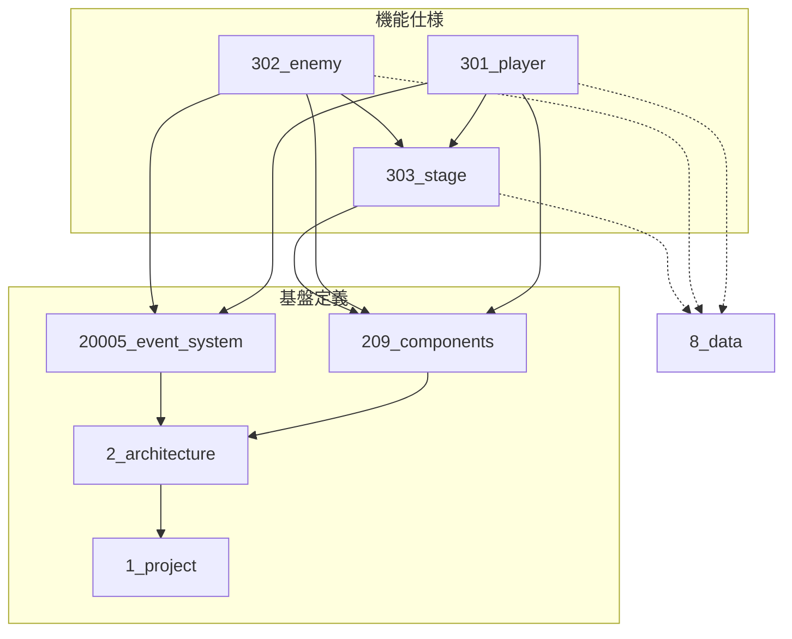

# /deps-graph コマンド

現在の仕様書構造から依存関係図（Mermaid形式）を再生成します。

**オプション**: $ARGUMENTS

## 使用者

**🤖 エージェント専用コマンド** - 人間は直接使わない

### 使用エージェント

| エージェント | 使用タイミング | 目的 |
|------------|--------------|------|
| deps-agent | dependencies.md更新後（必須） | 依存関係図の自動再生成 |

**自動実行**: エージェントが依存関係変更時に自動的に実行

## 使用方法

```
/deps-graph                              # 標準出力に表示
/deps-graph --output dependencies.md     # ファイルに出力
```

## オプション解析

`$ARGUMENTS` から以下を解析：
- `--output <file>`: 指定されたファイルに出力
- 引数なし: 標準出力に表示

## 指示

1. `docs/` 内の全ファイルをスキャン
2. Markdownリンクから依存関係を抽出
3. Mermaid形式の依存図を生成
4. `20002_dependencies.md` の図を更新

## 出力形式



## 凡例

- 実線（-->）: 依存関係（矢印の向き = 依存する側 → 依存される側）
- 破線（-.->）: データ参照（8_data への横断参照）

## 生成ルール

1. 各機能フォルダをノードとして表示
2. Markdownリンクを依存関係として抽出
3. 8_data への参照は破線で表示
4. 禁止依存は赤色でハイライト（検出された場合）

## 注意事項

- `_deprecated/` 内は除外
- 既存の `20002_dependencies.md` がある場合は更新

## 終了コード

| コード | 意味 |
|--------|------|
| 0 | 正常終了 |
| 1 | 出力ファイルへの書き込みエラー |
