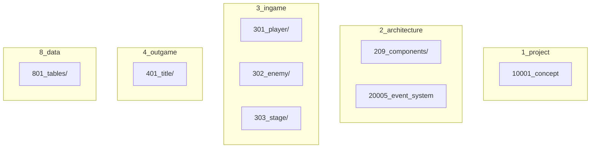

# 依存関係図

## Overview

このドキュメントは、仕様書間の依存関係を Mermaid 図で可視化します。

`/deps-graph` コマンドで自動更新されます。

---

## 層間の依存ルール

```
1_project     ← 全層から参照可（上位設計）
2_architecture ← 3, 4 層から参照可（共通設計）
3_ingame      ↔ 3_ingame 内で相互参照可
4_outgame     ↔ 4_outgame 内で相互参照可
8_data        ← 全層から参照可（独立層）
```

### 禁止依存

- 3_ingame → 4_outgame（逆も同様）
- 8_data → 他層（8_data は参照される専用）

---

## 依存関係図



---

## Component 参照一覧

| Component | 定義元 | 参照元 |
|-----------|--------|--------|
| (未定義) | - | - |

---

## Player ↔ Enemy の相互作用

Player と Enemy は **直接参照しない**。衝突判定などの相互作用は EventSystem 経由で実現する。

詳細な実装パターンは `20005_event_system.md` を参照（作成予定）。

---

## 更新履歴

| 日付 | 内容 |
|------|------|
| - | 初版作成（スケルトン） |
